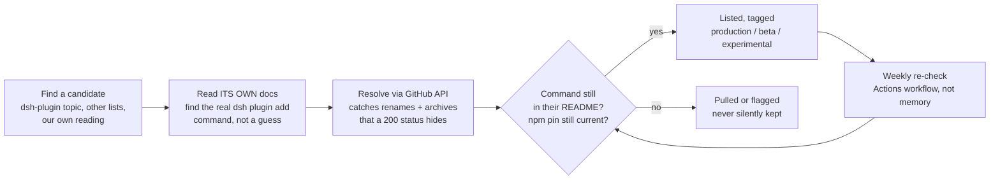

<p align="center">
  
</p>

<p align="center">
  <a href="https://awesome.re"></a>
  
  
  
  
  
  
  
</p>

<p align="center">
Curated by <a href="https://github.com/ZeroPointRepo">ZeroPointRepo</a>. Unofficial, community-maintained. Not affiliated with DeepSeek.
</p>

# Awesome DSH Plugins

**16 DeepSeek Harness (dsh) plugins, organized by what each one does for you. Every entry carries a
real `dsh plugin add` command we read out of the project's own docs and re-check every week.**

[DeepSeek Harness](https://github.com/deepseek-ai/deepseek-harness) (`dsh`) is DeepSeek's open-source
agent harness. Its whole design bet is one line: **everything is a plugin.** Models, tools, sandboxes,
session storage, the UI, even the agent loop itself all load as plugins. That bet paid off. Tens of
thousands of plugin repositories now carry the `dsh-plugin` topic.

Two things are true about that ecosystem at once. It is enormous, and most of it does not install. We
scanned the top 100 repositories carrying the `dsh-plugin` topic. **Only 22 publish a working
`dsh plugin add` command.** The rest are excellent general-purpose agent tools with no DSH install
path yet, or projects that added the topic for visibility. This list is the 16 that clear that bar,
organized by the problem they solve instead of an alphabet.

---

## Contents

- [⭐ Featured plugin](#-featured-plugin)
- [🚀 Where do I start?](#-where-do-i-start)
- [How every entry is verified](#how-every-entry-is-verified)
- [The catalog](#the-catalog)
  - [See and understand](#see-and-understand)
  - [Remember between sessions](#remember-between-sessions)
  - [Reshape the interface](#reshape-the-interface)
  - [Boost coding workflow](#boost-coding-workflow)
  - [Browse files and data](#browse-files-and-data)
  - [Git and code review](#git-and-code-review)
  - [Notifications and messaging](#notifications-and-messaging)
  - [Find and manage plugins](#find-and-manage-plugins)
  - [Connect our own data APIs](#connect-our-own-data-apis)
  - [Domain specific](#domain-specific)
- [Other ways to find dsh plugins](#other-ways-to-find-dsh-plugins)
- [What we left out](#what-we-left-out)
- [🛡️ Security notice](#️-security-notice)
- [🤝 Contributing](#-contributing)
- [Related lists](#related-lists)

---

## ⭐ Featured plugin

This slot rotates on merit, roughly one plugin in six from a strong batch. It is not a permanent
house slot. See [Contributing](#-contributing) for how a plugin earns it.

**Give a text-only model eyes** with [modlens](https://github.com/liustack/modlens) by
[liustack](https://github.com/liustack). The first vision plugin the DSH ecosystem got, and still
the reference one: paste an image into a text-only model's chat and get back structured JSON
evidence (OCR, layout, semantics) instead of a shrug. It set the pattern that most of the
ecosystem's other vision bridges now copy. 3,468★, MIT. **[production]**

```sh
dsh plugin --profile web add @liustack/modlens@3.22.1
```

---

## 🚀 Where do I start?

**1. Run DSH.** You need Node.js. Nothing else.

```sh
npx @deepseek-ai/dsh web
```

That serves the Web UI at `http://127.0.0.1:3080`.

**2. Install one plugin.** Almost every entry below follows the same shape:

```sh
dsh plugin --profile web add <package>
```

`--profile web` targets the composition behind `dsh web`, which is the right answer for most of this
list. Restart `dsh web` after installing.

**3. Pick the plugin that fixes what's annoying you right now.** Not sure? Start with
[modlens](#-featured-plugin) if your model is text-only, or [dsh-market](#find-and-manage-plugins) if
you would rather browse from inside the app.

> `dsh` is in **developer preview** and states plainly that there will be compatibility-breaking
> changes. Pin versions where this list does.

---

## How every entry is verified

We do not trust a README once and move on. Every entry in this list goes through the same pipeline,
and it re-runs every week, not just at launch.



That pipeline is a real GitHub Actions workflow in this repo
([`verify-installs.yml`](.github/workflows/verify-installs.yml)), not a diagram we drew and forgot.
It runs every Monday, re-reads each linked project's own README, confirms the install command's
package spec still appears there, checks any npm-pinned version against the registry's current
release, and writes the two badges at the top of this page from that run's actual result. Neither
badge is a hand-set claim. The workflow overwrites [`badges/verified.json`](badges/verified.json)
every run, and the badge simply displays that file. A stale README on our side would flip the badge
red before it flips a reader's install red.

**Why this matters more here than on most lists.** A pinned install command that has been superseded
upstream still resolves and still installs, so a plain link checker cannot see it rot. The
[DSH Plugin org list](https://github.com/awesome-dsh-plugin/awesome-dsh-plugin) and
[AdamPlatin123's radar](https://github.com/AdamPlatin123/awesome-dsh-plugins) both do real work here
too, see [Other ways to find dsh plugins](#other-ways-to-find-dsh-plugins). We built this pipeline
because command drift is the part of curation that decays fastest and shows the least.

---

## The catalog

Format: a bold line naming what the plugin does for you, then the plugin, its author, a factual
description, star count and license, and the install command we verified.

Tags: **production** (mature, widely installed) · **beta** (works, pre-1.0 or young) ·
**experimental** (early, worth watching).

### See and understand

Give a text-only model eyes.

- **Paste an image and get structured evidence back** with
  [modlens](https://github.com/liustack/modlens) by [liustack](https://github.com/liustack). OCR,
  layout, and semantics, not a guess. 3,468★, MIT. **[production]**
  ```sh
  dsh plugin --profile web add @liustack/modlens@3.22.1
  ```

- **Use a free, keyless vision route plus pixel tools** with
  [dsh-vision-router](https://github.com/ysr666/dsh-vision-router) by
  [ysr666](https://github.com/ysr666). OCR, grounding, crop, pixel diff, and screenshots, no API
  key required. 922★, MIT. **[production]**
  ```sh
  dsh plugin --profile web add dsh-vision-router
  ```

- **Ask questions about a pasted screenshot** with
  [dsh-vision-toolkit](https://github.com/Anionex/dsh-vision-toolkit) by
  [Anionex](https://github.com/Anionex). Image Q&A, long-screenshot OCR, and UI-to-code
  restoration for text-only models. 799★, MIT. **[production]**
  ```sh
  dsh plugin --profile web add @anionex/dsh-vision-toolkit
  ```

### Remember between sessions

- **Keep project memory and searchable notes across sessions** with
  [dsh-mnemon](https://github.com/omdsh-dev/dsh-mnemon) by
  [omdsh-dev](https://github.com/omdsh-dev). Local-first, cross-agent runtime context plus
  long-term recall. 146★, MIT. **[beta]**
  ```sh
  dsh plugin --profile web add dsh-mnemon
  ```

  Thin on purpose. Several higher-star "memory" repos we checked have no real `dsh plugin add`
  path, see [What we left out](#what-we-left-out). We would rather list one that installs than pad
  this section with names that do not.

### Reshape the interface

- **Add a task board, git graph, and mobile remote UI to the Web GUI** with
  [dsh-web-ui](https://github.com/zhu1090093659/dsh-web-ui) by
  [zhu1090093659](https://github.com/zhu1090093659). A plugin bundle with live token stats and a
  skin center too. 5,273★, Apache-2.0. **[production]**
  ```sh
  dsh plugin --profile web add @linxin666/dsh-web-ui-all@latest
  ```

- **Run DSH in a Claude Code style terminal UI** with
  [dsh-TUI](https://github.com/ccch1mneyyy/dsh-TUI) by
  [ccch1mneyyy](https://github.com/ccch1mneyyy). Live status line, streaming thought expansion,
  double-Esc rollback. 2,224★, MIT. **[production]**
  ```sh
  dsh plugin --profile dsh-tui add @deepseek-harness-tui/dsh-tui
  ```

- **Get interactive UI inline in assistant replies** with
  [dsh-genui](https://github.com/omdsh-dev/dsh-genui) by
  [omdsh-dev](https://github.com/omdsh-dev). Charts, forms, quizzes, Mermaid, and 3D scenes. 274★,
  MIT. **[beta]**
  ```sh
  dsh plugin --profile web add git+https://github.com/omdsh-dev/dsh-genui.git
  ```

- **Turn model output into visualization cards** with
  [dsh-visualize](https://github.com/Nagi-ovo/dsh-visualize) by
  [Nagi-ovo](https://github.com/Nagi-ovo). Renders interactive cards directly inside the
  conversation. 195★, BSD-3-Clause. **[beta]**
  ```sh
  dsh plugin --profile web add github:Nagi-ovo/dsh-visualize
  ```

### Boost coding workflow

- **Attach a workspace file to your prompt by searching for it** with
  [dsh-at-file](https://github.com/FSMargoo/dsh-at-file) by
  [FSMargoo](https://github.com/FSMargoo). Codex-style `@file` mentions in the composer. 444★,
  MIT. **[production]**
  ```sh
  dsh plugin --profile web add https://github.com/FSMargoo/dsh-at-file/archive/refs/tags/v0.6.7.tar.gz
  ```

  Thin on purpose. TokenTracker (usage tracking) and several "reasoning booster" repos we checked
  read DSH passively (session logs) or ship no `dsh plugin add` path at all. See
  [What we left out](#what-we-left-out).

### Browse files and data

No entry here yet. The strongest candidate we found, `Lum1104/dsh-browser` (356★), says plainly in
its own README that "the standard `dsh plugin` command alone cannot install this project." It needs
a separate shell installer plus a Chrome extension. That is a real, useful project. It just does not
clear this list's bar yet. We would rather leave this empty than list a command that does not work
the way every other entry's does. Open a PR the moment that changes.

### Git and code review

No entry here yet. We checked eleven candidates in this category with real GitHub activity. The
highest-starred cleared 2★. Nothing has separated from the pack. Watching it, will add the first
one that does.

### Notifications and messaging

- **Drive a DSH agent from Lark or Feishu chat** with
  [dsh-lark](https://github.com/omdsh-dev/dsh-lark) by [omdsh-dev](https://github.com/omdsh-dev).
  Tool approvals and plan reviews return as cards you tap. 40★, BSD-3-Clause. **[beta]**
  ```sh
  dsh plugin --profile web add dsh-lark-channel@latest
  ```

### Find and manage plugins

If you already know what you want to build, you want a plugin index rather than this list. These
answer *which plugin*, where this list answers *which problem*.

- **Browse and install plugins without leaving the app** with
  [dsh-market](https://github.com/dsh-market/dsh-market) by
  [dsh-market](https://github.com/dsh-market). Search, category filters, and one-click install
  from inside DSH's own settings. 1,529★, MIT. **[production]**
  ```sh
  dsh plugin --profile web add dshmarket
  ```

- **Ask your agent to find a plugin for you** with
  [dsh-find-plugin](https://github.com/awesome-dsh-plugin/dsh-find-plugin) by
  [awesome-dsh-plugin](https://github.com/awesome-dsh-plugin). Searches the live GitHub
  `dsh-plugin` topic by keyword, star-ranked. 71★, MIT. **[beta]**
  ```sh
  dsh plugin --profile web add dsh-find-plugin
  ```

- **Check a plugin's manifest before you ship it** with
  [dsh-plugin-check](https://github.com/omdsh-dev/dsh-plugin-check) by
  [omdsh-dev](https://github.com/omdsh-dev). Scans for manifest issues, patch-format problems, and
  build traps, and adds a `plugin_check` tool for the agent. 25★, MIT. **[experimental]**
  ```sh
  dsh plugin --profile web add github:omdsh-dev/dsh-plugin-check
  ```

### Connect our own data APIs

DSH wires a remote MCP server through
[`@deepseek-ai/dsh-mcp-client`](https://github.com/deepseek-ai/deepseek-harness/blob/main/packages/mcp/mcp-client/README.md)
using a small config file, not `dsh plugin add`. That is the command DSH's own docs use for every
remote MCP server; see their
[reference examples](https://github.com/deepseek-ai/deepseek-harness/tree/main/examples/mcp-memory).
Both entries below are ours. *(Maintainer's own — see [CONTRIBUTING](CONTRIBUTING.md#a-note-on-our-own-entries).)*
We built and tested each config file against DSH's own `StreamableHttpConfig` schema and confirmed
the server itself answers a live MCP `initialize` call over HTTPS with the key before listing it.
Neither is forced in. We hold our own entries to the same "does it actually work" bar as everyone
else's, and each sits alone in its category, same format as every other entry.

- **Search YouTube and pull transcripts** with
  [transcriptapi](https://github.com/ZeroPointRepo/youtube-mcp) by
  [ZeroPointRepo](https://github.com/ZeroPointRepo). Free tier, no Google API key needed.
  **[production]**
  ```sh
  curl -O https://raw.githubusercontent.com/ZeroPointRepo/awesome-dsh-plugins/main/mcp-configs/transcriptapi.cordis.yml
  TRANSCRIPTAPI_KEY=your-key dsh web --patch ./transcriptapi.cordis.yml
  ```

- **Look up Zillow property data** with
  [zillapi](https://github.com/ZeroPointRepo/zillow-mcp) by
  [ZeroPointRepo](https://github.com/ZeroPointRepo). Listings, valuations, and search, free tier
  available. **[production]**
  ```sh
  curl -O https://raw.githubusercontent.com/ZeroPointRepo/awesome-dsh-plugins/main/mcp-configs/zillapi.cordis.yml
  ZILLAPI_KEY=your-key dsh web --patch ./zillapi.cordis.yml
  ```

  Get a key at [transcriptapi.com](https://transcriptapi.com) or [zillapi.com](https://zillapi.com),
  set the environment variable, then run the command. Both config files live in
  [`mcp-configs/`](mcp-configs/) in this repo, in the exact shape DSH's `dsh-mcp-client` schema
  expects: `transport: streamable-http`, a `serverName`, a `url`, and an `Authorization: Bearer`
  header built from the env var. No key is hardcoded anywhere.

### Domain specific

- **Get expert guidance for HarmonyOS NEXT development** with
  [harmony-next.skills](https://github.com/linhay/harmony-next.skills) by
  [linhay](https://github.com/linhay). IDE workflow, API references, DevEco and emulator
  automation. 333★. **[production]**
  ```sh
  dsh plugin --profile demo add github:linhay/harmony-next.skills
  ```

---

## Other ways to find dsh plugins

If you want an index instead of a curated list, these are the two best ones, and they are why we
built this list the way we did.

**[DSH Plugin org list](https://github.com/awesome-dsh-plugin/awesome-dsh-plugin).**
10,800★+ and the largest single collection of DSH plugins that exists, organized into 21
categories. It is the right place to browse breadth: hundreds of entries per category, updated
constantly. What it does not give you is a signal for which of those hundreds is worth your time.
Entries are alphabetical by GitHub username within each category, with no star count, popularity
ranking, or install verification shown next to any of them. We counted more than 60 distinct
"vision bridge" plugins solving the same problem in one category alone, with nothing but the
description to tell them apart.

**[AdamPlatin123/awesome-dsh-plugins](https://github.com/AdamPlatin123/awesome-dsh-plugins).**
Genuinely sophisticated: a Kubernetes pipeline that runtime-tests thousands of candidate plugins
and renders the process as an in-README Mermaid diagram, the pattern we borrowed the idea of
showing (not the pipeline itself) for the section above. Two real gaps kept us from just pointing
readers there instead of building this. First, by its own README: "this directory is not a package
manager and has no install command verified by this repository." It tells you a plugin's manifest
loaded in a test container, not what to type. Second, its four-tier compatibility system (运行级可用
/ 运行级不兼容 / 待定 / 未测, tied to k8s snapshot IDs and run IDs) is built for ecosystem insiders,
not a newcomer who wants a command that works in the next 30 seconds.

Both are worth bookmarking. Neither replaces having 16 commands you can paste in and trust.

## What we left out

`dsh-plugin` is one of the hottest topics on GitHub right now, and the tag is doing a lot of work it
was not designed for. We scanned the top 100 repositories carrying it. **Only 22 publish a working
`dsh plugin add` command.** The rest are a mix of excellent general-purpose agent tools with no DSH
install path yet, and projects that added the topic for visibility.

Specific repos we checked and left out, with the reason, because "we were thorough" is a claim you
should be able to check rather than trust:

- **EverMind-AI/EverOS** (12,288★). A genuinely strong cross-agent memory layer. Its own README has
  no `dsh plugin add` command and no mention of DeepSeek Harness at all. It installs as a Python
  package (`uv pip install everos`) for other tools. A rival list's runtime pipeline marks it
  "tested ✅" for DSH, which tells you their harness can install and run the package, not that it
  wires into `dsh` as a plugin. Those are different claims. The moment EverOS ships a real DSH
  integration, it belongs at the top of [Remember between sessions](#remember-between-sessions).
- **xiufengsun/TokenTracker** (1,391★). Reads DSH's session logs passively as one of many supported
  tools. Nothing installs into DSH itself.
- **Lum1104/dsh-browser** (356★). Real and useful, but its own README says the standard `dsh plugin`
  command cannot install it alone. It needs a separate installer script plus a Chrome extension.
- Eleven git and code-review plugins we checked, none past 2★. We would rather ship an honestly
  empty category than a padded one.

Some of the most-starred repositories carrying the `dsh-plugin` topic are absent for exactly this
reason. That is not a judgement on their quality. The moment one ships a real DSH install path, it
belongs here. Please open a pull request when that happens.

We would rather ship 16 entries you can actually run than 60 you cannot.

---

## 🛡️ Security notice

This is a **curated list, not a security audit**. Installing a plugin runs third-party code on your
machine with your own permissions. It can read your files, use your credentials, and reach the
network. A tag on this list means the install command works and the project is real and active as of
its last check, not that the code has been reviewed for safety. Read a plugin's source before you
install it or hand it credentials, the same as you would any package or browser extension.

## 🤝 Contributing

PRs are very welcome, see [CONTRIBUTING.md](CONTRIBUTING.md) for the format and the acceptance
rules. **Disclosure:** the maintainer of this list also builds developer tools
([TranscriptAPI](https://transcriptapi.com), [StayingAPI](https://stayingapi.com),
[Zillapi](https://zillapi.com)) and lists two of them above once a genuinely working entry existed,
never before. Our entries follow the exact same format and bar as everyone else's, appear at most
once per category, and we never reject a competing entry to protect ours.

## Related lists

- **[awesome-dsh-usecases](https://github.com/ZeroPointRepo/awesome-dsh-usecases).** Same
  ecosystem, different axis. That list answers "what can I actually do with dsh" (23 use cases,
  each naming the plugin that solves it). This one answers "which plugin should I install." Start
  with usecases if you do not know what you want yet, start here if you do.
- **[DSH Plugin org list](https://github.com/awesome-dsh-plugin/awesome-dsh-plugin)** and
  **[AdamPlatin123/awesome-dsh-plugins](https://github.com/AdamPlatin123/awesome-dsh-plugins).**
  See [Other ways to find dsh plugins](#other-ways-to-find-dsh-plugins) above.

---

<p align="center">
Maintained by <a href="https://github.com/ZeroPointRepo">ZeroPointRepo</a> · list content licensed
<a href="https://creativecommons.org/licenses/by/4.0/">CC BY 4.0</a> · Built with <a href="https://crhq.ai">crhq.ai</a>
<br />
<sub>This is an unofficial, community-maintained list. It is not affiliated with or endorsed by
DeepSeek or the DeepSeek Harness project.</sub>
</p>
