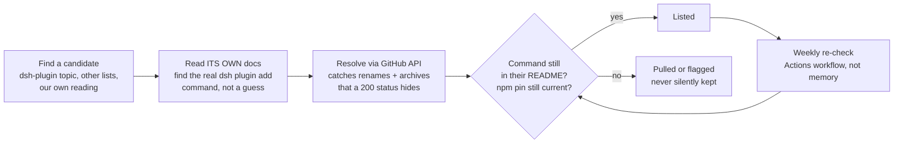

<p align="center">
  
</p>

<p align="center">
  <a href="https://awesome.re"></a>
  
  
  
  
  
  
  
</p>

# Awesome DSH Plugins

**76 DeepSeek Harness (dsh) plugins, organized by what each one does for you.**

[DeepSeek Harness](https://github.com/deepseek-ai/deepseek-harness) (`dsh`) is DeepSeek's
open-source agent harness, built on one bet: everything is a plugin. This list catalogs the ones
that actually install, sorted by the job they do for you instead of the alphabet.

---

## Contents

- [⭐ Featured plugin](#-featured-plugin)
- [🚀 Where do I start?](#-where-do-i-start)
- [The catalog](#the-catalog)
  - [See and understand](#see-and-understand)
  - [Search the web](#search-the-web)
  - [Remember between sessions](#remember-between-sessions)
  - [Reshape the interface](#reshape-the-interface)
  - [Make it yours](#make-it-yours)
  - [Boost coding workflow](#boost-coding-workflow)
  - [Run a team of agents](#run-a-team-of-agents)
  - [Browse files and data](#browse-files-and-data)
  - [Git and code review](#git-and-code-review)
  - [Notifications and messaging](#notifications-and-messaging)
  - [Remote access and mobile](#remote-access-and-mobile)
  - [Usage, cost, and account tracking](#usage-cost-and-account-tracking)
  - [Find and manage plugins](#find-and-manage-plugins)
  - [Providers and subscriptions](#providers-and-subscriptions)
  - [Security and safety](#security-and-safety)
  - [Connect our own data APIs](#connect-our-own-data-apis)
  - [Domain specific](#domain-specific)
- [Good to know](#good-to-know)

---

## ⭐ Featured plugin

**Paste an image and get structured evidence back** with [modlens](https://github.com/liustack/modlens) by [liustack](https://github.com/liustack). OCR, layout, and semantics for text-only models, not a guess. The first vision plugin the DSH ecosystem got, and still the reference one: it set the pattern most of the ecosystem's other vision bridges now copy. 3,486★, MIT.

```sh
dsh plugin --profile web add @liustack/modlens@3.22.1
```

---

## 🚀 Where do I start?

**1. Run DSH.** You need Node.js. Nothing else.

```sh
npx @deepseek-ai/dsh web
```

That serves the Web UI at `http://127.0.0.1:3080`.

**2. Install one plugin.** Almost every entry below follows the same shape:

```sh
dsh plugin --profile web add <package>
```

`--profile web` targets the composition behind `dsh web`, which is the right answer for most of
this list. Restart `dsh web` after installing.

**3. Pick the plugin that fixes what's annoying you right now.** Not sure? Start with
[modlens](#-featured-plugin) if your model is text-only, or [dsh-market](#find-and-manage-plugins)
if you would rather browse from inside the app.

> `dsh` is in **developer preview** and states plainly that there will be compatibility-breaking
> changes. Pin versions where this list does.

---

## The catalog

### See and understand

- **Paste an image and get structured evidence back** with [modlens](https://github.com/liustack/modlens) by [liustack](https://github.com/liustack). OCR, layout, and semantics for text-only models, not a guess. 3,486★, MIT.

  <details>
  <summary>Install</summary>

  ```sh
  dsh plugin --profile web add @liustack/modlens@3.22.1
  ```

  </details>

- **Use a free, keyless vision route plus pixel tools** with [dsh-vision-router](https://github.com/ysr666/dsh-vision-router) by [ysr666](https://github.com/ysr666). OCR, grounding, crop, pixel diff, and screenshots. No API key. 925★, MIT.

  <details>
  <summary>Install</summary>

  ```sh
  dsh plugin --profile web add dsh-vision-router
  ```

  </details>

- **Ask questions about a pasted screenshot** with [dsh-vision-toolkit](https://github.com/Anionex/dsh-vision-toolkit) by [Anionex](https://github.com/Anionex). Image Q&A, long-screenshot OCR, and UI-to-code restoration for text-only models. 803★, MIT.

  <details>
  <summary>Install</summary>

  ```sh
  dsh plugin --profile web add @anionex/dsh-vision-toolkit
  ```

  </details>

- **Add a three-model vision and image-generation fallback chain** with [dsh-media-skills](https://github.com/MJorgin/dsh-media-skills) by [MJorgin](https://github.com/MJorgin). GLM-4V, Qwen3-VL, and Gemini failover so a dropped call never means no eyes. 16★, MIT.

  <details>
  <summary>Install</summary>

  ```sh
  dsh plugin --profile web add github:MJorgin/dsh-media-skills
  ```

  </details>


### Search the web

- **Ask the web or X and get structured evidence back** with [modsearch](https://github.com/liustack/modsearch) by [liustack](https://github.com/liustack). Search, scrape, and citations for models with no native web access. 206★, MIT.

  <details>
  <summary>Install</summary>

  ```sh
  dsh plugin --profile web add @liustack/modsearch@5.8.0
  ```

  </details>

- **Add a multi-provider web search backend** with [anysearch-dsh](https://github.com/anysearch-team/anysearch-dsh) by [anysearch-team](https://github.com/anysearch-team). One search tool that routes across several providers instead of locking you to one. 174★, MIT.

  <details>
  <summary>Install</summary>

  ```sh
  dsh plugin --profile web add @anysearch/anysearch-dsh
  ```

  </details>

- **Get persistent, cached multi-engine search** with [dsh-web-search-pro](https://github.com/anweat/dsh-web-search-pro) by [anweat](https://github.com/anweat). SQLite and LRU caching plus real page rendering, so repeat queries do not re-fetch. 29★, MIT.

  <details>
  <summary>Install</summary>

  ```sh
  dsh plugin --profile web add dsh-web-search-pro
  ```

  </details>

- **Wire in SearXNG search and a Crawl4AI fetch tool** with [dsh-surfing-plugin](https://github.com/cyijun/dsh-surfing-plugin) by [cyijun](https://github.com/cyijun). Self-hostable search and clean-page extraction, no vendor API key required. 12★, MIT.

  <details>
  <summary>Install</summary>

  ```sh
  dsh plugin --profile web add dsh-surfing-plugin
  ```

  </details>


### Remember between sessions

- **Get a three-tier memory control plane** with [dsh-mnemon](https://github.com/omdsh-dev/dsh-mnemon) by [omdsh-dev](https://github.com/omdsh-dev). Persistent runtime context, searchable project documents, and pluggable long-term memory in one plugin. 152★, MIT.

  <details>
  <summary>Install</summary>

  ```sh
  dsh plugin --profile web add dsh-mnemon
  ```

  </details>

- **Add memory your agent has to ask permission to use** with [dsh-memento](https://github.com/PerryLink/dsh-memento) by [PerryLink](https://github.com/PerryLink). Layered, approval-gated, auditable cross-session memory backed by SQLite. 59★, Apache-2.0.

  <details>
  <summary>Install</summary>

  ```sh
  dsh plugin --profile web add dsh-memento
  ```

  </details>

- **Give your agent durable, inspectable long-term memory** with [dsh-noema](https://github.com/ZSeven-W/dsh-noema) by [ZSeven-W](https://github.com/ZSeven-W). Recall tools plus a settings page so you can see exactly what it remembers. 120★, MIT.

  <details>
  <summary>Install</summary>

  ```sh
  dsh plugin --profile web add @zseven-w/dsh-noema@latest
  ```

  </details>

- **Store memory as Markdown you can read and edit yourself** with [dsh-mneme](https://github.com/modusensus/dsh-mneme) by [modusensus](https://github.com/modusensus). Offline semantic search over an entity-attribute-timeline, with nightly self-consolidation. 31★, MIT.

  <details>
  <summary>Install</summary>

  ```sh
  dsh plugin --profile web add @modusensus/dsh-mneme
  ```

  </details>

- **Let your agent write and manage its own skills between sessions** with [dsh-memory-evolve](https://github.com/csyangwen/dsh-memory-evolve) by [csyangwen](https://github.com/csyangwen). Five-track memory, git-branch awareness, and a self-review pass at the end of every turn. 211★, MIT.

  <details>
  <summary>Install</summary>

  ```sh
  dsh plugin --profile web add github:csyangwen/dsh-memory-evolve
  ```

  </details>


### Reshape the interface

- **Add a task board, git graph, and mobile remote UI** with [dsh-web-ui](https://github.com/zhu1090093659/dsh-web-ui) by [zhu1090093659](https://github.com/zhu1090093659). A whole plugin bundle for the Web GUI, live token stats and a skin center included. 5,333★, Apache-2.0.

  <details>
  <summary>Install</summary>

  ```sh
  dsh plugin --profile web add @linxin666/dsh-web-ui-all@latest
  ```

  </details>

- **Run DSH in a Claude Code style terminal UI** with [dsh-TUI](https://github.com/ccch1mneyyy/dsh-TUI) by [ccch1mneyyy](https://github.com/ccch1mneyyy). Live status line, streaming thought expansion, double-Esc rollback. 2,241★, MIT.

  <details>
  <summary>Install</summary>

  ```sh
  dsh plugin --profile dsh-tui add @deepseek-harness-tui/dsh-tui
  ```

  </details>

- **Get interactive UI components inline in replies** with [dsh-genui](https://github.com/omdsh-dev/dsh-genui) by [omdsh-dev](https://github.com/omdsh-dev). Charts, forms, quizzes, Mermaid diagrams, and 3D scenes, with an event loop back to the model. 282★, MIT.

  <details>
  <summary>Install</summary>

  ```sh
  dsh plugin --profile web add git+https://github.com/omdsh-dev/dsh-genui.git
  ```

  </details>

- **Turn model output into visualization cards** with [dsh-visualize](https://github.com/Nagi-ovo/dsh-visualize) by [Nagi-ovo](https://github.com/Nagi-ovo). Renders interactive cards directly inside the conversation. 196★, BSD-3-Clause.

  <details>
  <summary>Install</summary>

  ```sh
  dsh plugin --profile web add github:Nagi-ovo/dsh-visualize
  ```

  </details>

- **Get an open sidebar foundation other plugins can register into** with [DSH-better-sidebar](https://github.com/omdsh-dev/DSH-better-sidebar) by [omdsh-dev](https://github.com/omdsh-dev). Built-in file editor, terminal, Git, and sub-agent pages out of the box. 2,542★, MIT.

  <details>
  <summary>Install</summary>

  ```sh
  dsh plugin --profile web add dsh-better-sidebar@latest
  ```

  </details>

- **See exactly what your context window is made of** with [dsh-context](https://github.com/bowenliang123/dsh-context) by [bowenliang123](https://github.com/bowenliang123). A context dashboard and browser for composition, breakdown, and compaction events. 647★, Apache-2.0.

  <details>
  <summary>Install</summary>

  ```sh
  dsh plugin --profile web add dsh-context
  ```

  </details>

- **Explore a conversation as a branching canvas** with [dsh-synapse](https://github.com/liangmianya/dsh-synapse) by [liangmianya](https://github.com/liangmianya). A visual, non-linear workspace for sessions instead of one long scroll. 128★, MIT.

  <details>
  <summary>Install</summary>

  ```sh
  dsh plugin --profile web add github:liangmianya/dsh-synapse
  ```

  </details>

- **Read a simplified view of a session** with [dsh-focus-chat](https://github.com/dingyi222666/dsh-focus-chat) by [dingyi222666](https://github.com/dingyi222666). Strips a conversation down to the final output, for when you just want the answer. 21★.

  <details>
  <summary>Install</summary>

  ```sh
  dsh plugin --profile web add @dingyi222666/dsh-focus-chat
  ```

  </details>


### Make it yours

- **Skin DSH with the Catppuccin palette** with [dsh-catppuccin-theme](https://github.com/NoNameLeGo/dsh-catppuccin-theme) by [NoNameLeGo](https://github.com/NoNameLeGo). Latte, Frappe, Macchiato, and Mocha, one-click switch, with an optional glass finish. 15★, MIT.

  <details>
  <summary>Install</summary>

  ```sh
  dsh plugin --profile web add @nonamelego/dsh-catppuccin
  ```

  </details>

- **Install a desktop pet in one line** with [dsh-pet](https://github.com/PC2005-cloud/dsh-pet) by [PC2005-cloud](https://github.com/PC2005-cloud). 28 transparent animations ready to go, or build your own from the included asset pipeline. 271★, MIT.

  <details>
  <summary>Install</summary>

  ```sh
  dsh plugin --profile web add dsh-pet
  ```

  </details>

- **Reskin DSH with an industrial fan-art shell** with [dsh-endfield-ui](https://github.com/rison114514/dsh-endfield-ui) by [rison114514](https://github.com/rison114514). A full alternate UI treatment for the Web GUI, unofficial and clearly labelled as such. 27★.

  <details>
  <summary>Install</summary>

  ```sh
  dsh plugin --profile web add @rison/dsh-endfield-ui
  ```

  </details>

- **Turn the whole interface into frosted glass** with [DSH-Transparent-UI-Plugin](https://github.com/WYH66666666/DSH-Transparent-UI-Plugin) by [WYH66666666](https://github.com/WYH66666666). Adjustable blur and frost on every panel, off switch returns you to the stock UI instantly. 355★, MIT.

  <details>
  <summary>Install</summary>

  ```sh
  dsh plugin --profile web add dsh-client-ui-aqua
  ```

  </details>


### Boost coding workflow

- **Attach a workspace file to your prompt by searching for it** with [dsh-at-file](https://github.com/FSMargoo/dsh-at-file) by [FSMargoo](https://github.com/FSMargoo). Codex-style @file mentions in the composer. 445★, MIT.

  <details>
  <summary>Install</summary>

  ```sh
  dsh plugin --profile web add https://github.com/omdsh-dev/dsh-at-file/archive/refs/tags/v0.6.7.tar.gz
  ```

  </details>

- **Write declarative allow, deny, and ask rules for tools** with [dsh-permission-rules](https://github.com/PerryLink/dsh-permission-rules) by [PerryLink](https://github.com/PerryLink). Claude-Code-style rules matched on tool name, arguments, and workspace path, with a session-log audit. 25★, Apache-2.0.

  <details>
  <summary>Install</summary>

  ```sh
  dsh plugin --profile web add dsh-permission-rules
  ```

  </details>

- **Get a nicer diff card for every edit** with [dsh-diff-viewer](https://github.com/lehhair/dsh-diff-viewer) by [lehhair](https://github.com/lehhair). Replaces the stock diff block for write and edit tool calls. 24★.

  <details>
  <summary>Install</summary>

  ```sh
  dsh plugin --profile web add "github:lehhair/dsh-diff-viewer"
  ```

  </details>

- **Let routine tool calls run without a prompt each time** with [dsh-auto-mode](https://github.com/NanmiCoder/dsh-auto-mode) by [NanmiCoder](https://github.com/NanmiCoder). Safe automatic permissions instead of approving the same command over and over. 115★, MIT.

  <details>
  <summary>Install</summary>

  ```sh
  dsh plugin --profile web add @nanmicoder/dsh-auto-mode
  ```

  </details>

- **Roll a conversation and the workspace back together** with [dsh-turn-rewind](https://github.com/Anionex/dsh-turn-rewind) by [Anionex](https://github.com/Anionex). A persistent change ledger undoes code state alongside chat state. 94★, BSD-3-Clause.

  <details>
  <summary>Install</summary>

  ```sh
  dsh plugin --profile web add @anionex/dsh-turn-rewind
  ```

  </details>

- **Cut the token cost of every file edit** with [dsh-better-edit](https://github.com/Rianico/dsh-better-edit) by [Rianico](https://github.com/Rianico). Hash-anchored read, edit, and undo tools that avoid re-sending whole files. 12★, MIT.

  <details>
  <summary>Install</summary>

  ```sh
  dsh plugin --profile web add github:Rianico/dsh-better-edit
  ```

  </details>


### Run a team of agents

- **Dispatch work across a team of agents** with [dsh-agent-teams](https://github.com/NanmiCoder/dsh-agent-teams) by [NanmiCoder](https://github.com/NanmiCoder). Coordinated multi-agent execution instead of one model doing everything serially. 743★, MIT.

  <details>
  <summary>Install</summary>

  ```sh
  dsh plugin --profile web add @nanmicoder/dsh-agent-teams
  ```

  </details>

- **Turn one-shot multi-agent runs into a saved workflow** with [dsh_workflow](https://github.com/omdsh-dev/dsh_workflow) by [omdsh-dev](https://github.com/omdsh-dev). Generate, save, govern, and resume a multi-agent pipeline instead of starting from scratch each time. 92★, MIT.

  <details>
  <summary>Install</summary>

  ```sh
  dsh plugin --profile web add "github:dsh-external/dsh_workflow#main"
  ```

  </details>

- **Run persistent multi-model teams with a real console** with [dsh-agent-team-gui](https://github.com/toolclub/dsh-agent-team-gui) by [toolclub](https://github.com/toolclub). Dynamic lead planning, bounded task graphs, and per-agent model and tool settings. 113★, MIT.

  <details>
  <summary>Install</summary>

  ```sh
  dsh plugin --profile web add -w github:toolclub/dsh-agent-team-gui
  ```

  </details>

- **Configure sub-agent profiles instead of hardcoding them** with [dsh-plugin-yet-another-subagent](https://github.com/HuanLinOTO/dsh-plugin-yet-another-subagent) by [HuanLinOTO](https://github.com/HuanLinOTO). One sub-agent tool with a profile parameter, plus a live sub-agent tree in the Web UI. 12★.

  <details>
  <summary>Install</summary>

  ```sh
  dsh plugin --profile web add @huanlin/dsh-plugin-yet-another-subagent
  ```

  </details>


### Browse files and data

- **Generate, read, and edit Office files in chat** with [dsh-office](https://github.com/omdsh-dev/dsh-office) by [omdsh-dev](https://github.com/omdsh-dev). Spreadsheets, PDFs, and presentations, without leaving the conversation. 15★, Apache-2.0.

  <details>
  <summary>Install</summary>

  ```sh
  dsh plugin --profile web add @huiliyi37/dsh-office
  ```

  </details>

- **Preview and edit spreadsheets, docs, and slides inline** with [dsh-univer-office](https://github.com/dream-num/dsh-univer-office) by [dream-num](https://github.com/dream-num). Full office document editing inside DSH, powered by Univer. 60★, Apache-2.0.

  <details>
  <summary>Install</summary>

  ```sh
  dsh plugin --profile web add dsh-univer-office
  ```

  </details>

- **Get a real file tree in the sidebar** with [dsh-file-explorer](https://github.com/joejojoking-cloud/dsh-file-explorer) by [joejojoking-cloud](https://github.com/joejojoking-cloud). Preview, syntax-highlighted in-panel editing, and a VS Code hand-off. 15★.

  <details>
  <summary>Install</summary>

  ```sh
  dsh plugin --profile web add dsh-file-explorer
  ```

  </details>

- **Turn PDFs and Office files into clean Markdown** with [dsh-plugin-mineru](https://github.com/HuanLinOTO/dsh-plugin-mineru) by [HuanLinOTO](https://github.com/HuanLinOTO). Exposes MinerU document parsing as a tool the model can call directly. 38★.

  <details>
  <summary>Install</summary>

  ```sh
  dsh plugin --profile web add @huanlin/dsh-plugin-mineru
  ```

  </details>

- **Upload a file and let the model actually read it** with [dsh-files](https://github.com/taxueseek/dsh-files) by [taxueseek](https://github.com/taxueseek). Colorful composer cards plus a read_document tool that sniffs PDF, DOCX, and XLSX content. 18★.

  <details>
  <summary>Install</summary>

  ```sh
  dsh plugin --profile web add dsh-files
  ```

  </details>


### Git and code review

- **Run a code review bot natively inside DSH** with [dsh-reviewer-bot](https://github.com/chaojixinren/dsh-reviewer-bot) by [chaojixinren](https://github.com/chaojixinren). Cross-platform, rules are pluggable, and a review can be replayed locally. 13★, MIT.

  <details>
  <summary>Install</summary>

  ```sh
  dsh plugin --profile web add @dshrb/bundle
  ```

  </details>

- **Get browser automation, an MCP server, and GitHub or GitLab review in one install** with [reef](https://github.com/huey1in/reef) by [huey1in](https://github.com/huey1in). Five modules, one plugin: automation, MCP, review, and a native panel. 15★, MIT.

  <details>
  <summary>Install</summary>

  ```sh
  dsh plugin --profile web add dsh-reef
  ```

  </details>

- **Review a diff the moment the agent makes it** with [dsh-file-review](https://github.com/left0ver/dsh-file-review) by [left0ver](https://github.com/left0ver). See exactly what changed in a file right after an edit, before you keep going. 22★, MIT.

  <details>
  <summary>Install</summary>

  ```sh
  dsh plugin --profile web add dsh-file-review
  ```

  </details>


### Notifications and messaging

- **Drive a DSH agent from Lark or Feishu chat** with [dsh-lark](https://github.com/omdsh-dev/dsh-lark) by [omdsh-dev](https://github.com/omdsh-dev). Tool approvals and plan reviews return as cards you tap. 42★, BSD-3-Clause.

  <details>
  <summary>Install</summary>

  ```sh
  dsh plugin --profile web add dsh-lark-channel@latest
  ```

  </details>

- **Connect nine chat platforms to DSH at once** with [dsh-im](https://github.com/xmanrui/dsh-im) by [xmanrui](https://github.com/xmanrui). Feishu, WeChat, DingTalk, QQ, Slack, Telegram, Discord, WhatsApp, and WeCom, via QR code or credentials. 320★, MIT.

  <details>
  <summary>Install</summary>

  ```sh
  dsh plugin --profile web add -w @xmanrui/dsh-im
  ```

  </details>

- **Wire a QQ bot into DSH with Tencent's own plugin** with [dsh-qqbot](https://github.com/tencent-connect/dsh-qqbot) by [tencent-connect](https://github.com/tencent-connect). The official connector for the QQ Bot platform. 71★, MIT.

  <details>
  <summary>Install</summary>

  ```sh
  dsh plugin --profile qqbot add @tencent-connect/dsh-qqbot
  ```

  </details>

- **Get one notify API and eight channel adapters** with [dsh-notifier](https://github.com/THEWOLFWALKER/dsh-notifier) by [THEWOLFWALKER](https://github.com/THEWOLFWALKER). Telegram, DingTalk, Feishu, WxPusher, PushPlus, ServerChan, Bark, and plain webhooks, from a single call. 55★, MIT.

  <details>
  <summary>Install</summary>

  ```sh
  dsh plugin --profile web add dsh-notifier
  ```

  </details>

- **Get a desktop notification when a turn finishes** with [dsh-notification](https://github.com/omdsh-dev/dsh-notification) by [omdsh-dev](https://github.com/omdsh-dev). Per-outcome controls and keyword rules decide what actually pings you. 70★, MIT.

  <details>
  <summary>Install</summary>

  ```sh
  dsh plugin --profile web add https://github.com/omdsh-dev/dsh-notification/archive/refs/tags/v0.1.3.tar.gz
  ```

  </details>


### Remote access and mobile

- **Scan a QR code to reach your desktop DSH from your phone** with [dsh-pocket](https://github.com/shaobeichen/dsh-pocket) by [shaobeichen](https://github.com/shaobeichen). Real-time mirrored access over LAN or the public internet. 310★, GPL-2.0.

  <details>
  <summary>Install</summary>

  ```sh
  dsh plugin --profile web add dsh-pocket -w
  ```

  </details>

- **Reach your dev machine with no server at all** with [dsh-tether](https://github.com/zexadev/dsh-tether) by [zexadev](https://github.com/zexadev). Peer-to-peer connection over iroh, works across networks without renting a relay. 13★, MIT.

  <details>
  <summary>Install</summary>

  ```sh
  dsh plugin --profile web add dsh-plugin-tether
  ```

  </details>

- **Get an auditable, token-gated remote gateway** with [dsh-full-remote](https://github.com/JUANWANG-BUAA/dsh-full-remote) by [JUANWANG-BUAA](https://github.com/JUANWANG-BUAA). Mobile QR access with per-device sessions and settings for credentials and directories. 19★, MIT.

  <details>
  <summary>Install</summary>

  ```sh
  dsh plugin --profile web add dsh-full-remote
  ```

  </details>

- **Chat with your local DSH from WeChat or QQ** with [dsh-bridge](https://github.com/wenbin-wb/dsh-bridge) by [wenbin-wb](https://github.com/wenbin-wb). Multi-channel remote access with no public server required, streaming output and workspace switching included. 13★, MIT.

  <details>
  <summary>Install</summary>

  ```sh
  dsh plugin --profile web add @wenbin_wb/dsh-bridge
  ```

  </details>


### Usage, cost, and account tracking

- **Track session and daily cost against a budget** with [dsh-cost-meter](https://github.com/Han-1413141/dsh-cost-meter) by [Han-1413141](https://github.com/Han-1413141). Provider balances, peak and off-peak pricing, and a 90-plus model pricing catalog, kept in sync automatically. 139★, MIT.

  <details>
  <summary>Install</summary>

  ```sh
  dsh plugin --profile web add dsh-cost-meter
  ```

  </details>

- **See provider balances and quota burn in one panel** with [dsh-usage-stats](https://github.com/Ychris12138/dsh-usage-stats) by [Ychris12138](https://github.com/Ychris12138). Token-usage analytics for the Web GUI, refreshed live. 98★, MIT.

  <details>
  <summary>Install</summary>

  ```sh
  dsh plugin --profile web add "github:Ychris12138/dsh-usage-stats"
  ```

  </details>

- **Track token usage with zero setup** with [TokenLedger](https://github.com/zh667/TokenLedger) by [zh667](https://github.com/zh667). Attributes usage per relay site, no credentials or config file needed. 124★, MIT.

  <details>
  <summary>Install</summary>

  ```sh
  dsh plugin --profile web add "github:zh667/TokenLedger"
  ```

  </details>

- **See the live model price in the session header** with [dsh-client-pricing](https://github.com/Miyazawai/dsh-client-pricing) by [Miyazawai](https://github.com/Miyazawai). Peak and off-peak pricing badge that updates as you switch models. 16★, MIT.

  <details>
  <summary>Install</summary>

  ```sh
  dsh plugin --profile web add dsh-client-pricing
  ```

  </details>


### Find and manage plugins

- **Browse and install plugins without leaving the app** with [dsh-market](https://github.com/dsh-market/dsh-market) by [dsh-market](https://github.com/dsh-market). Search, category filters, and one-click install from inside settings. 1,570★, MIT.

  <details>
  <summary>Install</summary>

  ```sh
  dsh plugin --profile web add dshmarket
  ```

  </details>

- **Ask your agent to find a plugin for you** with [dsh-find-plugin](https://github.com/awesome-dsh-plugin/dsh-find-plugin) by [awesome-dsh-plugin](https://github.com/awesome-dsh-plugin). Searches the live GitHub dsh-plugin topic by keyword, star-ranked. 73★, MIT.

  <details>
  <summary>Install</summary>

  ```sh
  dsh plugin --profile web add dsh-find-plugin
  ```

  </details>

- **Check a plugin's manifest before you ship it** with [dsh-plugin-check](https://github.com/omdsh-dev/dsh-plugin-check) by [omdsh-dev](https://github.com/omdsh-dev). Scans for manifest issues, patch-format problems, and build traps. 27★, MIT.

  <details>
  <summary>Install</summary>

  ```sh
  dsh plugin --profile web add github:omdsh-dev/dsh-plugin-check
  ```

  </details>

- **Browse plugins the way you would browse Steam Workshop** with [dsh-plugin-workshop](https://github.com/yyyyukari/dsh-plugin-workshop) by [yyyyukari](https://github.com/yyyyukari). Zero-server, GitHub-powered search with trending windows and one-click install. 25★, MIT.

  <details>
  <summary>Install</summary>

  ```sh
  dsh plugin --profile web add "github:yyyyukari/dsh-plugin-workshop"
  ```

  </details>

- **Get a safety net before you install anything** with [dsh-plugin-guard](https://github.com/lxzy-7/dsh-plugin-guard) by [lxzy-7](https://github.com/lxzy-7). Pre-install snapshots plus one-click or automatic rollback if a plugin breaks your boot. 28★, MIT.

  <details>
  <summary>Install</summary>

  ```sh
  dsh plugin --profile web add github:lxzy-7/dsh-plugin-guard
  ```

  </details>

- **Manage every plugin from one panel** with [dsh-web-plugin-manager](https://github.com/LX2000WASD/dsh-web-plugin-manager) by [LX2000WASD](https://github.com/LX2000WASD). Enable, disable, install, update, and health-check, dependency and conflict analysis included. 62★, MIT.

  <details>
  <summary>Install</summary>

  ```sh
  dsh plugin --profile web add dsh-web-plugin-manager@latest
  ```

  </details>


### Providers and subscriptions

- **Use a ChatGPT, Claude, or X Premium subscription as a DSH provider** with [dsh-plugin-subscriptions](https://github.com/V1ki/dsh-plugin-subscriptions) by [V1ki](https://github.com/V1ki). OAuth login in the Web UI, no separate API keys to manage. 216★, MIT.

  <details>
  <summary>Install</summary>

  ```sh
  dsh plugin --profile web add dsh-plugin-subscriptions
  ```

  </details>

- **Use your ChatGPT subscription through OpenAI's own Codex sign-in** with [dsh-codex](https://github.com/Yan-Zero/dsh-codex) by [Yan-Zero](https://github.com/Yan-Zero). No API key, authenticates the same way the official Codex CLI does. 38★, Apache-2.0.

  <details>
  <summary>Install</summary>

  ```sh
  dsh plugin --profile web add dsh-codex
  ```

  </details>

- **Run local MLX models as a native provider** with [rapid-mlx-dsh-provider](https://github.com/raullenchai/rapid-mlx-dsh-provider) by [raullenchai](https://github.com/raullenchai). DSH reads model facts straight from the server instead of a hand-edited settings file. 20★, Apache-2.0.

  <details>
  <summary>Install</summary>

  ```sh
  dsh plugin --profile web add @raullenchai/dsh-provider
  ```

  </details>


### Security and safety

- **Audit your API relay for prompt injection and worse** with [api-relay-audit](https://github.com/toby-bridges/api-relay-audit) by [toby-bridges](https://github.com/toby-bridges). A local, offline scan for model substitution, tool-call rewriting, and error leakage on any LLM proxy. 797★, AGPL-3.0.

  <details>
  <summary>Install</summary>

  ```sh
  dsh plugin --profile web add "github:toby-bridges/api-relay-audit#latest"
  ```

  </details>

- **Have a second model review approval requests** with [dsh-auto-review](https://github.com/PerryLink/dsh-auto-review) by [PerryLink](https://github.com/PerryLink). A read-only reviewer returns allow or deny with reasons, fails closed by default, fully auditable. 64★, Apache-2.0.

  <details>
  <summary>Install</summary>

  ```sh
  dsh plugin --profile web add dsh-auto-review
  ```

  </details>

- **Audit your own DSH install** with [dsh-security-audit](https://github.com/omdsh-dev/dsh-security-audit) by [omdsh-dev](https://github.com/omdsh-dev). A read-only, local report on config, plugin sources, sessions, and network exposure. 13★, MIT.

  <details>
  <summary>Install</summary>

  ```sh
  dsh plugin --profile web add github:omdsh-dev/dsh-security-audit
  ```

  </details>


### Connect our own data APIs

- **Search YouTube and pull transcripts** with [transcriptapi](https://github.com/ZeroPointRepo/youtube-mcp) by [ZeroPointRepo](https://github.com/ZeroPointRepo). Free tier, no Google API key needed.

  <details>
  <summary>Install</summary>

  ```sh
  curl -O https://raw.githubusercontent.com/ZeroPointRepo/awesome-dsh-plugins/main/mcp-configs/transcriptapi.cordis.yml
  TRANSCRIPTAPI_KEY=your-key dsh web --patch ./transcriptapi.cordis.yml
  ```

  Get a key at [transcriptapi.com](https://transcriptapi.com).
  </details>

- **Look up Zillow property data** with [zillapi](https://github.com/ZeroPointRepo/zillow-mcp) by [ZeroPointRepo](https://github.com/ZeroPointRepo). Listings, valuations, and search, free tier available.

  <details>
  <summary>Install</summary>

  ```sh
  curl -O https://raw.githubusercontent.com/ZeroPointRepo/awesome-dsh-plugins/main/mcp-configs/zillapi.cordis.yml
  ZILLAPI_KEY=your-key dsh web --patch ./zillapi.cordis.yml
  ```

  Get a key at [zillapi.com](https://zillapi.com).
  </details>


### Domain specific

- **Get expert guidance for HarmonyOS NEXT development** with [harmony-next.skills](https://github.com/linhay/harmony-next.skills) by [linhay](https://github.com/linhay). IDE workflow, API references, DevEco and emulator automation. 333★.

  <details>
  <summary>Install</summary>

  ```sh
  dsh plugin --profile demo add github:linhay/harmony-next.skills
  ```

  </details>

- **Drive Blender from a conversation** with [blender](https://github.com/CheshireJCat/blender) by [CheshireJCat](https://github.com/CheshireJCat). Modeling, reconstruction, rendering, validation, and export workflows. 18★, MIT.

  <details>
  <summary>Install</summary>

  ```sh
  dsh plugin --profile web add dsh-blender
  ```

  </details>

- **Run embodied-intelligence research from DSH** with [dsh-robotic-harness](https://github.com/dingkaihu63/dsh-robotic-harness) by [dingkaihu63](https://github.com/dingkaihu63). Robot asset inspection, MuJoCo pick-place simulation, and reproducible experiment bundles. 17★, MIT.

  <details>
  <summary>Install</summary>

  ```sh
  dsh plugin --profile rh-demo add ./packages/dsh-bundle
  ```

  </details>

- **Get a trading research workbench** with [dsh-trading](https://github.com/maddogfinance/dsh-trading) by [maddogfinance](https://github.com/maddogfinance). A typed market-data layer, deterministic indicators, and interactive chart cards. 12★, MIT.

  <details>
  <summary>Install</summary>

  ```sh
  dsh plugin --profile trading add @dsh-trading/bundle
  ```

  </details>

- **Deploy a project and provision infrastructure from chat** with [sealos-skills](https://github.com/labring/sealos-skills) by [labring](https://github.com/labring). Databases, object storage, and one-command deploys on Sealos. 73★.

  <details>
  <summary>Install</summary>

  ```sh
  dsh plugin --profile web add github:labring/sealos-skills
  ```

  </details>

- **Switch DSH into a penetration-testing mode** with [dsh-pentest](https://github.com/howmp/dsh-pentest) by [howmp](https://github.com/howmp). Purpose-built for authorized security research and testing workflows. 168★.

  <details>
  <summary>Install</summary>

  ```sh
  dsh plugin --profile web add https://github.com/howmp/dsh-pentest/releases/latest/download/dsh-pentest.tar.gz
  ```

  </details>


---

## Good to know

<details>
<summary><strong>How every entry is verified</strong></summary>

We do not trust a README once and move on. Every entry in this list goes through the same pipeline,
and it re-runs every week, not just at launch.



That pipeline is a real GitHub Actions workflow in this repo
([`verify-installs.yml`](.github/workflows/verify-installs.yml)), not a diagram we drew and forgot.
It runs every Monday, re-reads each linked project's own README, confirms the install command's
package spec still appears there, checks any npm-pinned version against the registry's current
release, and writes the two badges at the top of this page from that run's actual result. Neither
badge is a hand-set claim: the workflow overwrites [`badges/verified.json`](badges/verified.json)
every run, and the badge simply displays that file.

</details>

<details>
<summary><strong>🛡️ Security notice</strong></summary>

This is a **curated list, not a security audit**. Installing a plugin runs third-party code on your
machine with your own permissions. It can read your files, use your credentials, and reach the
network. A plugin's presence here means the install command works and the project is real and
active as of its last check, not that the code has been reviewed for safety. Read a plugin's source
before you install it or hand it credentials, the same as you would any package or browser
extension.

Found a plugin that seems malicious rather than merely broken? Open an issue and say so plainly, or
use GitHub's private vulnerability reporting on the plugin's own repo if it has one enabled.

</details>

<details>
<summary><strong>🤝 Contributing</strong></summary>

PRs are very welcome, see [CONTRIBUTING.md](CONTRIBUTING.md) for the format and the acceptance
rules.

</details>

---

<p align="center">
Maintained by <a href="https://github.com/ZeroPointRepo">ZeroPointRepo</a> · list content licensed
<a href="https://creativecommons.org/licenses/by/4.0/">CC BY 4.0</a> · Built with
<a href="https://crhq.ai">crhq.ai</a>
<br />
<sub>Unofficial, community-maintained. Not affiliated with or endorsed by DeepSeek or the DeepSeek
Harness project. The maintainer also builds <a href="https://transcriptapi.com">TranscriptAPI</a>
and <a href="https://zillapi.com">Zillapi</a>, both listed above once a genuinely working entry
existed, never before, see <a href="CONTRIBUTING.md#a-note-on-our-own-entries">CONTRIBUTING</a>.</sub>
</p>
